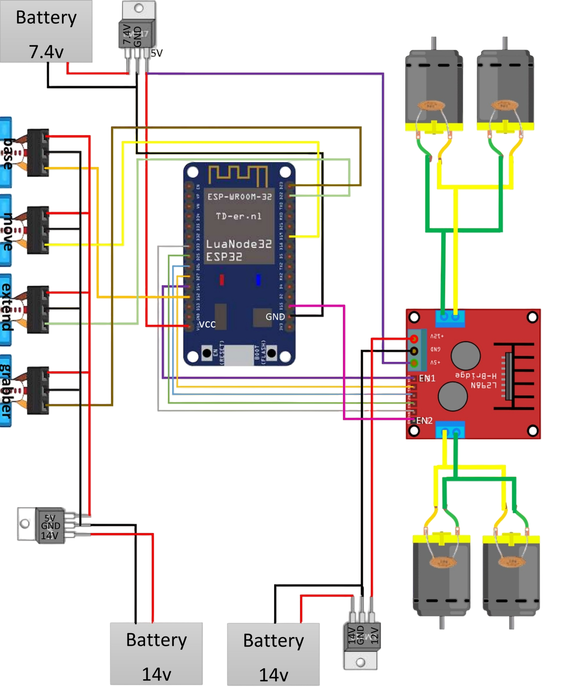
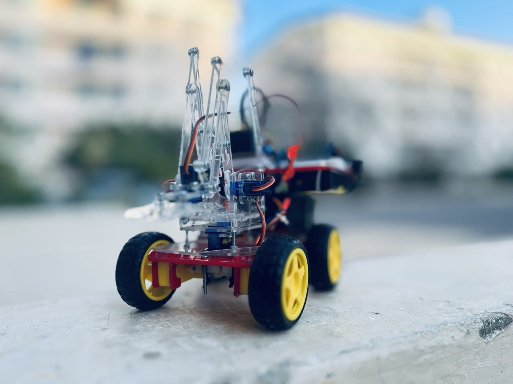
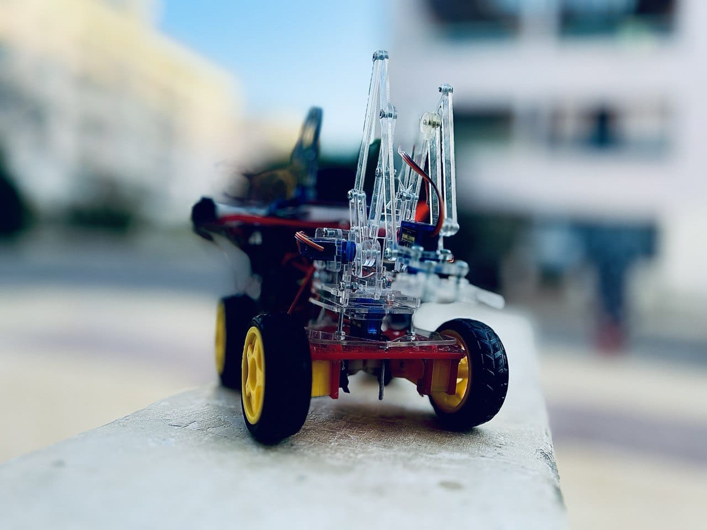
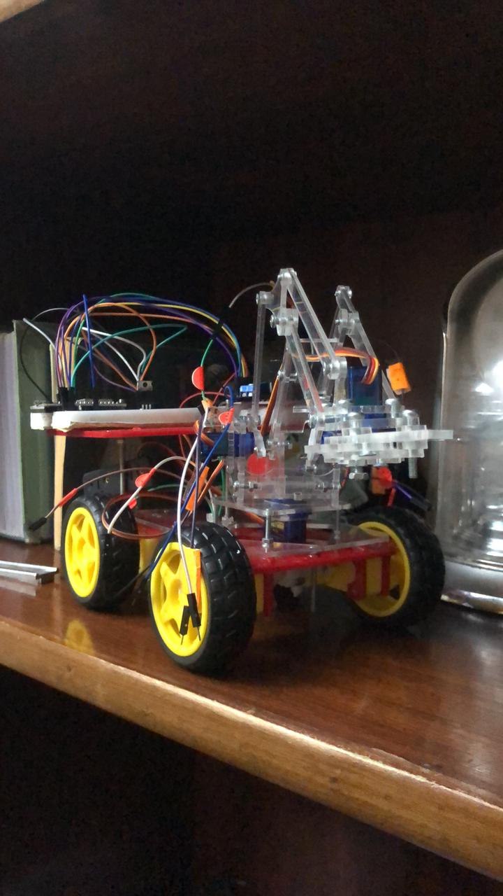

# Robotic Arm Car Project

Welcome to the **Robotic Arm Car Project**, an innovative robotic system designed to navigate and interact with environments remotely. Equipped with a robotic arm and a Bluetooth-controlled system, this project demonstrates the integration of mechanical design, control systems, and software engineering.

---

## 📖 Overview

The **Robotic Arm Car** is designed to perform precise movements, allowing for tasks such as lifting, manipulating, and rotating objects. It uses Bluetooth communication for remote control, enabling the operator to control the car's movements and the robotic arm with ease. 

The system is suitable for various applications, including hazardous environment navigation, such as bomb disposal operations.

---

## 📊 System Diagram

To visualize the structure and components of the project, refer to the system diagram:

---

## 🚀 Features

- **Motorized Car Movement**: Forward, backward, left, and right directional control.
- **Robotic Arm**: Capable of lifting, rotating, and manipulating objects.
- **Bluetooth Integration**: Wireless communication for seamless remote control.
- **Precise Control**: Stepper motors and servos ensure accuracy in motion.
- **Customizable**: Extend functionality with additional sensors or modules.

---

## ⚙️ System Requirements

- **Microcontroller**: ESP32
- **Actuators**: Servos for the robotic arm, DC motors for movement.
- **Motor Driver**: Supports PWM for speed control.
- **Bluetooth Module**: Integrated with the ESP32.
- **Power Supply**: Ensure adequate power for motors and microcontroller.

---

## 📂 Code Features

### Libraries Used
- `BluetoothSerial`: For Bluetooth communication.
- `ESP32Servo`: To control the robotic arm servos.

### Pin Configuration
- **Motor Pins**: 27, 26, 25, 33 (DC Motor Control)
- **Servo Pins**: 12, 19, 22, 23 (Base, Move, Extend, Grabber)
- **PWM Channels**: For precise speed control of DC motors.

### Core Functions
1. **Motor Control**:
   - Commands: 
     - `'F'` - Forward
     - `'B'` - Backward
     - `'L'` - Left
     - `'R'` - Right
     - `'S'` - Stop
2. **Servo Control**:
   - Handles angles for base, move, extend, and grabber servos.
3. **Bluetooth Communication**:
   - Reads commands from the Bluetooth-connected device.

---

## 📝 How to Use

1. **Upload the Code**:
   - Open the `.ino` file in the Arduino IDE.
   - Connect your ESP32 via USB.
   - Select the appropriate board and COM port.
   - Upload the code.

2. **Hardware Setup**:
   - Connect motors and servos to the ESP32.
   - Attach power supply for motors and the ESP32.
   - Pair your Bluetooth-enabled device with the ESP32.

3. **Control the Robot**:
   - Use a Bluetooth app to send commands to control movements and the robotic arm.

---

## 🔧 Example Commands

- **Car Movement**:
  - `F` - Move Forward
  - `B` - Move Backward
  - `L` - Turn Left
  - `R` - Turn Right
  - `S` - Stop
- **Arm Movement**:
  - Send angles (e.g., `45` for base rotation, `1180` for arm extension).

---

## 🎥 Project Media

### Photos

### Videos
<video src="img/VID-20230503-WA0026.mp4" width="320" height="240" controls preload="metadata">Video 1</video>
<video src="img/VID-20230503-WA0027.mp4" width="320" height="240" controls preload="metadata">Video 2</video>

---

## 📄 License

This project is licensed under the [MIT License](LICENSE).

---

## 🤝 Contributions

Contributions and suggestions are welcome! Feel free to fork the repository and submit a pull request.

---

## ✉️ Contact

For any inquiries or feedback, please reach out to:
- **Email**: omar.algamel@example.com
- **GitHub**: [Omar Algamel](https://github.com/omar-algamel)

---

Thank you for exploring the **Robotic Arm Car Project**! 🤖🚗
